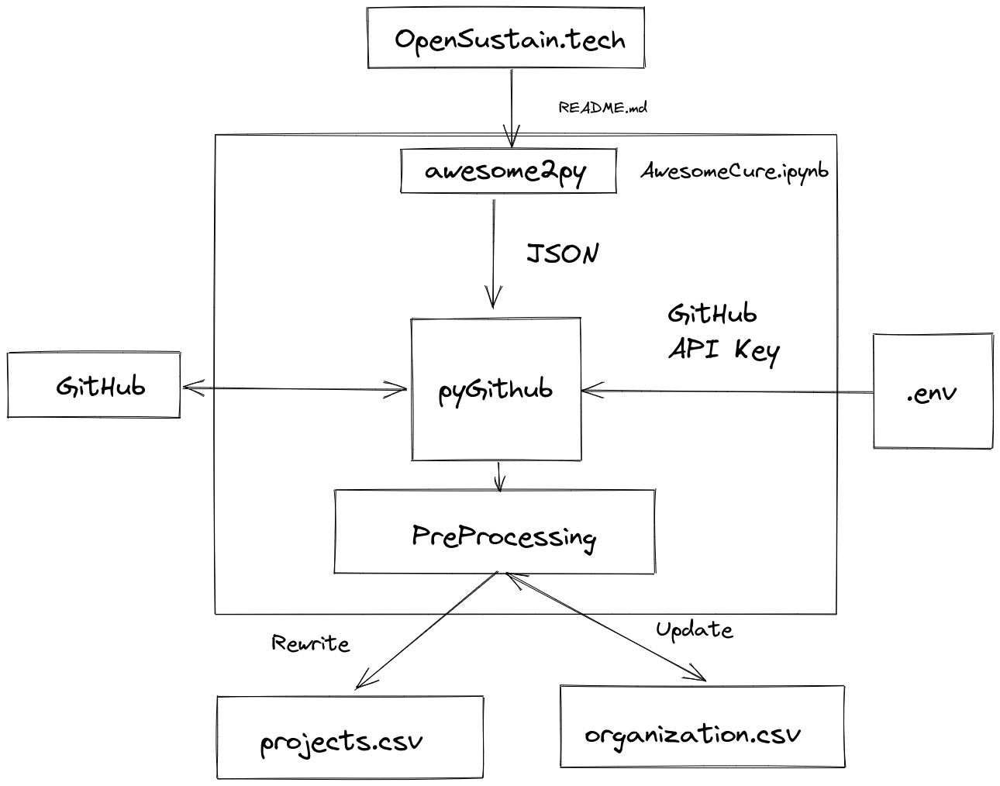
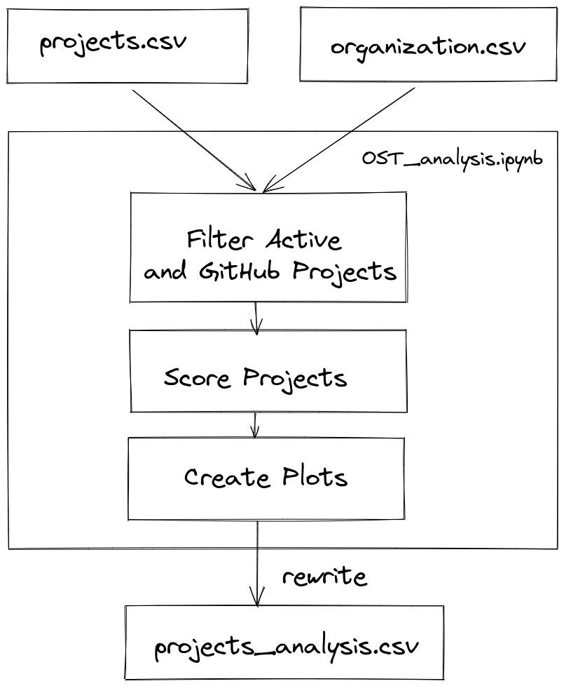
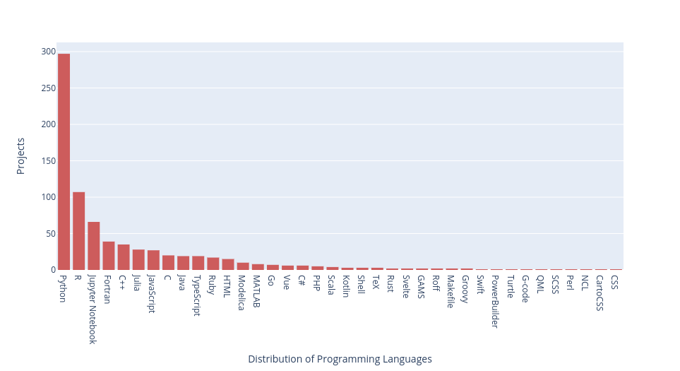
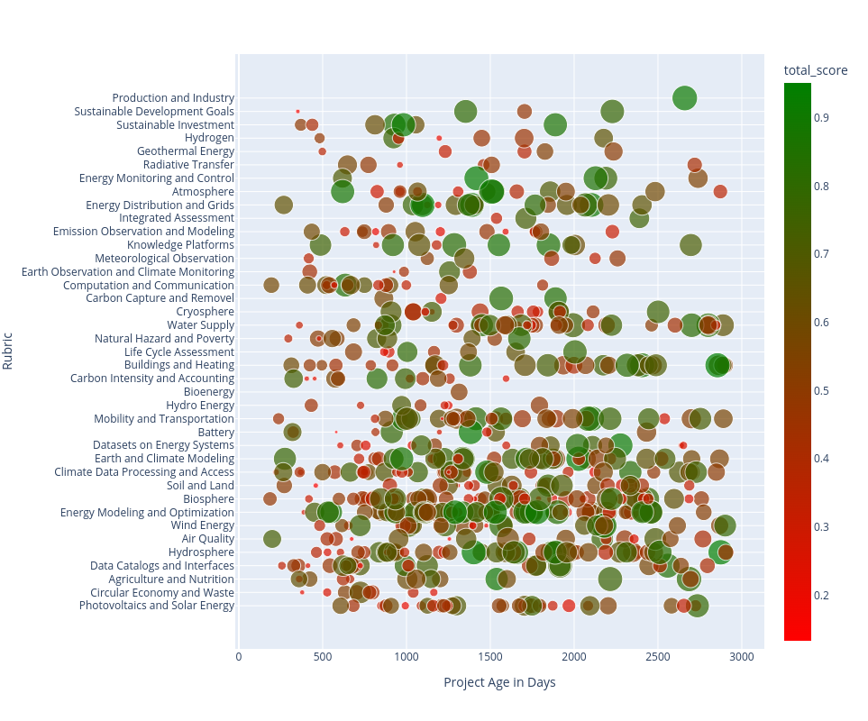
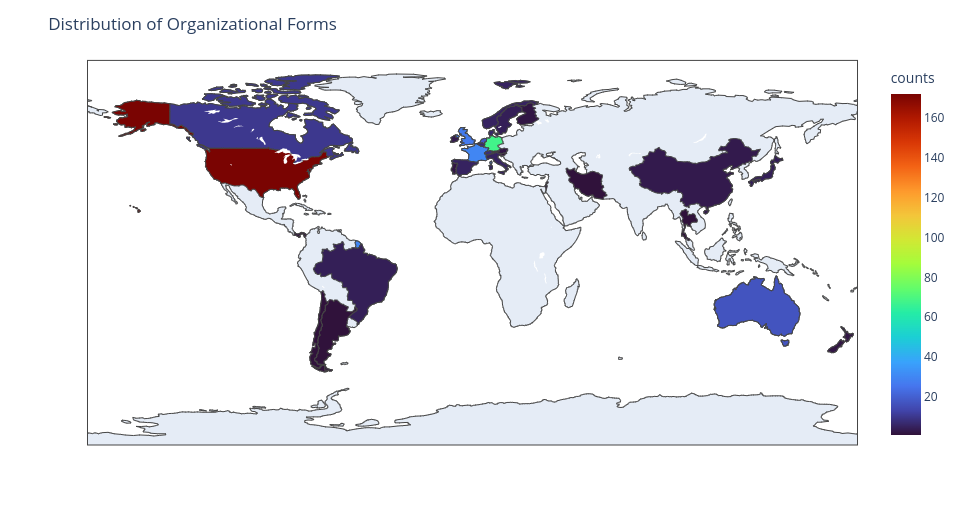
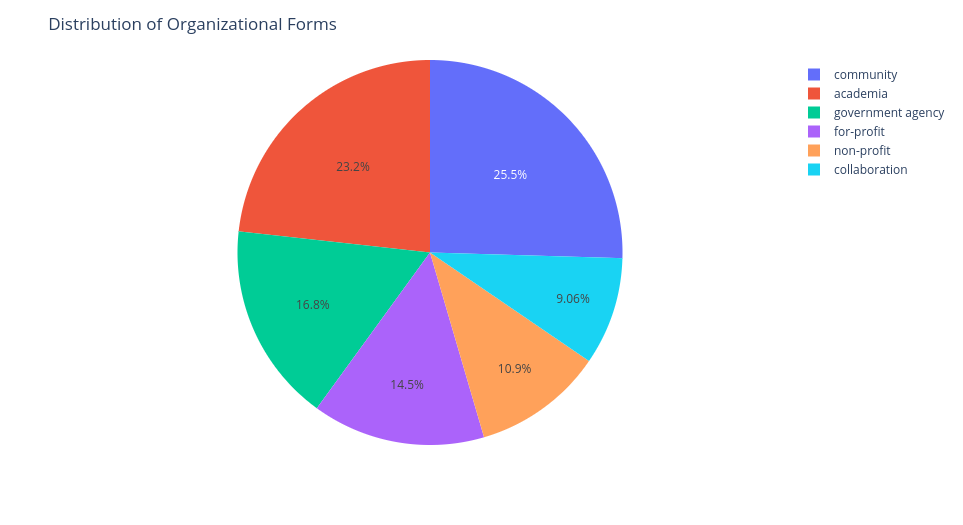

# AwesomeCure
>  Analyze and cure awesome lists by collecting, processing and presenting data from listed Git projects.

 [](https://mybinder.org/v2/gh/protontypes/AwesomeCure.git/HEAD)

AwesomeCure provides basic scripts to analyze Git projects within an Awesome list getting an overview of the represented open source domains. Use the GitHub API to retrieve meta data and generate various metrics about the state of open source ecosystems. As a result, spreadsheets and plots are created to sort and analyze all entries according to you needs. 

## Background

Awesome lists are a central part of the open source ecosystem. They allow developers to get an overview of open source projects in different domains. A state of the art cross-platform search engine for open source projects does not yet exist. Therefore, those lists represent central indexes for the diverse open source communities. Interfaces can be created between projects, development resources are concentrated and the wheel is not reinvented again and again.

Maintaining an Awesome list requires removing inactive projects on a regular basis, investigating new projects and engaging the community to update the list. Without these measures, new and still active projects get lost in the multitude of inactive projects. The processing of such list gives the possibility to analyze these ecosystems with the help of data science methods in order to identify potentials and risks within the domain. 

## Application
The [OpenSustain.tech](https://opensustain.tech/) website is based on such an Awesome list, giving an overview of the active open source projects in climate and sustainable technology. In the current prototype project state, AwesomeCure can only be applied to this list, but generalization to all Awesome lists is possible.

Most of the entries are linked to GitHub or GitLab repository of the underlying project. Therefore, AwesomeCure is able to analyze every project via the platform API to extract meta data from the listed projects. In this way, various health indicators are extracted like:

* Last activity
* Community Distribution Score ( How much does the project depend on a single person)
* Number of reviews per pull request
* Days until the last commit and last closed issue
* Total number of stars, contributors
* Use licenses 
* Any many more...

## Install

Clone the GitHub repository:

```
git clone git@github.com:protontypes/AwesomeCure.git
```

Install Jupiter notebook:

```
pip install jupyterlab
pip install notebook
```

Install the dependencies:

```
cd AwesomeCure
pip install -r requirements.txt   
```

Add a `.env` with your personal GitHub token to the root project folder (see more information on that [here](https://docs.github.com/en/authentication/keeping-your-account-and-data-secure/creating-a-personal-access-token)).  Give the API key the minimum number of permissions. The `.env` file is excluded from version control by the .gitignore file and in this way not uploaded to GitHub. Open the .env file with your favored editor and add 
```
GITHUB=Your_API_Key
```

Run the Jupyter Notebook
```
jupyter notebook
```
A browser window should open, if not, click (or copy paste) the link from your terminal output.

## Architecture

The project was split into two Jupyter notebooks.  One for data acquisition and one for data processing and plotting. 

### Data Acquisition

The [AwesomeCure.ipynb](./awesomecure.ipynb) notebook lets you read the Awesome list from any repository. Depending on the size of the list the processing can take multiple hours.



### Data Processing

Data processing is done in the [ost_analysis.ipynb](ost_analysis.ipynb) with the output csv files form the data acquisition. Since not API key is needed for this step the processing can also been done online within Binder:

 [](https://mybinder.org/v2/gh/protontypes/AwesomeCure.git/HEAD)



## Results
Plotting the dataset gives insides into the Open Source Ecosystems from different perspectives. 

### Programming Languages 



### Project Scores 




### Communities and Organizations 




